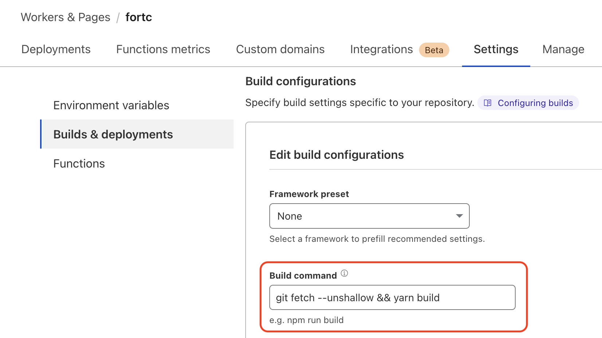

## Issue

Docusaurus [can display the "last updated" value](https://docusaurus.io/docs/api/plugins/@docusaurus/plugin-content-docs#showLastUpdateTime) by looking at the full git history of the repo while building the site. However, Cloudflare's build pipeline does a shallow clone and the "last updated" value is not accurate.

## Solution

To work around this issue, add a build step at Cloudflare to fetch the full git history before the site is built.

1. In the Cloudflare dashboard, navigate to **Workers & Pages**, then open the Pages project.
1. In the **Settings** tab, select **Builds & deployments**.
1. In the **Build configuration** section, prepend `git fetch --unshallow &&` to the **Build command**.
1. Click **Save**.

The **Last Updated** value should display correctly after the next deployment.

## Example

Assuming that `yarn` builds the site, the updated command is:

```bash
git fetch --unshallow && yarn build
```


