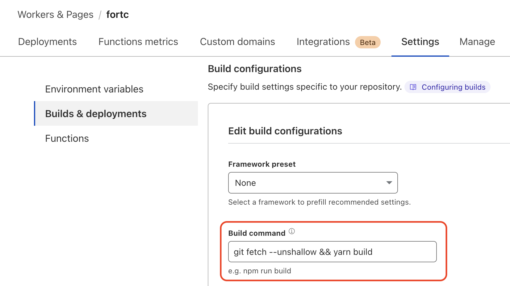

## Issue

Docusaurus [can display the "last updated" value](https://docusaurus.io/docs/api/plugins/@docusaurus/plugin-content-docs#showLastUpdateTime) on documentation pages with the configuration item `showLastUpdateTime: true`.

However, this requires the full git history during the build, and Cloudflare's default build pipeline performs a shallow clone without the necessary git history.

## Solution

To work around this issue, modify the build step at Cloudflare.

1. In the Cloudflare dashboard, navigate to **Workers & Pages**, then open the Pages project.
1. In the **Settings** tab, select **Builds & deployments**.
1. In the **Build configuration** section, prepend `git fetch --unshallow &&` to the **Build command**.
1. Click **Save**.

This performs a second fetch with the full history before building the site. The **Last Updated** value should display correctly after the next deployment.

## Example

Assuming that `yarn` builds the site, the updated command is:

```bash
git fetch --unshallow && yarn build
```


